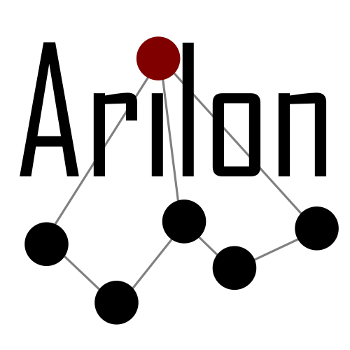

**A**mazing **R**elationship **N**amer
---
--- 
Arilon is a library to calculate a relationship identifier between two nodes in a given graph.

## Example

```csharp
using Arilon.Core;
using Arilon.Core.Abstractions;
using Arilon.Database.InFiles;
var nodes = new List<INode> { new Node("node1"), new Node("node2") };
var edges = new List<IEdge> { new Edge("edge1", "node1", "node2") };
IDataProvider dataProvider = new InFileDataProvider(nodes, edges);
Arilon arilon = new Arilon(dataProvider);

ArilonResult result = await arilon.CalculateRelationIdentifier("node1", "node2");
```

## Thanks

This library was made with the help and dedication from @NKaufhold and Shawn

## License
MIT see [LICENSE](LICENSE.TXT)
